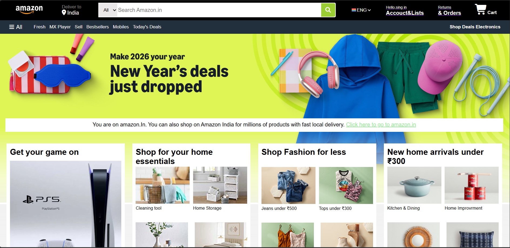

<div align="center">
  
  
  # Amazon E-Commerce Web Clone

  <p>A high-fidelity, multi-page frontend UI clone of the Amazon web interface built from scratch using HTML5 and CSS3.</p>

  <p>
    
    
    
  </p>

  <br/>
  <p align="center">
    
  </p>
  <br/>
  
</div>

---

## 📖 Table of Contents
- [About the Project](#-about-the-project)
- [Features](#-features)
- [Pages Overview](#-pages-overview)
- [Project Structure](#-project-structure)
- [Tech Stack](#-tech-stack)
- [Getting Started](#-getting-started)
- [Future Roadmap](#-future-roadmap)
- [Author](#-author)

---

## 🚀 About the Project

This project is a detailed frontend recreation of the Amazon desktop website, featuring the key components shown in the visual showcase above. The goal was to practice complex web layouts, master CSS Flexbox, and understand how large-scale e-commerce platforms structure their user interfaces. 

> **Note:** This is a static UI/UX clone. It does not currently contain backend functionality, databases, or live payment processing.

---

## ✨ Features

* **Authentic Navigation:** Recreated the iconic Amazon top navigation bar, including the categorized search dropdown, language selector, and sub-navigation panel.
* **Complex Grid Layouts:** Utilized CSS Flexbox to create responsive, multi-item product cards on the homepage.
* **Multi-Page Architecture:** Includes distinct, linked pages for the main storefront, user registration, and order history, all styled consistently.
* **Custom Styling:** Heavy use of CSS gradients, background positioning, and box-shadows to mimic Amazon's depth and visual hierarchy.
* **Iconography:** Integrated FontAwesome for scalable, high-quality UI icons.

---

## 📂 Pages Overview

| Page | File | Description |
| :--- | :--- | :--- |
| **Home Page** | `index.html` | The main landing page featuring hero banners, categorized product recommendations (4-grid layouts), and a comprehensive multi-column footer. |
| **Registration** | `Registration.html` | A clean, focused authentication page accurately replicating the Amazon "Create Account" workflow and form styling. |
| **Returns & Orders** | `Returns.html` | A user dashboard view featuring a tabbed interface and detailed order cards with dynamic status colors and action buttons. |

---

## 🏗️ Project Structure

```text
AMAZON WEBCLONE/
├── images/                  # Directory containing all local image assets
│   ├── preview.png          # The multi-page project showcase screenshot
│   ├── amazon_logo.png
│   ├── new 1.webp
│   └── ... (product images)
├── index.html               # Main Storefront
├── Registration.html        # Account Creation UI
├── Returns.html             # Order History Dashboard
└── style.css                # Global stylesheet for the Home Page